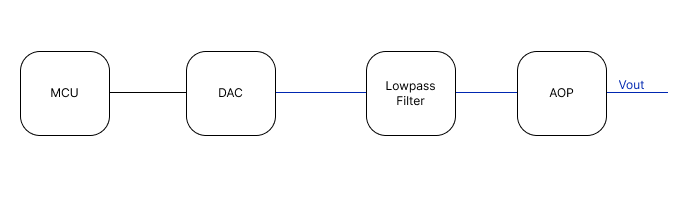

# iotlab-pilotcase-neurawave

Neurawave is a company based in Kalmar, Sweden. They provides solution for migraine relief. Their vision is to eradicate migraine pain and give all migraines sufferers control over their migraines and their lives.
# Table of contents
- [iotlab-pilotcase-neurawave](#iotlab-pilotcase-neurawave)
- [Table of contents](#table-of-contents)
- [Software](#software)
  - [IDE used](#ide-used)
  - [How it works](#how-it-works)
- [Hardware](#hardware)
  - [Equipment used](#equipment-used)
  - [Schematic](#schematic)
- [Results](#results)

# Software
## IDE used 
 This project has been develop on VSCode with PlatformIO extension and using the arduino framework.

## How it works

The software implements in this project allow to create the signal we need. For this we use a lookup table which is an array with all the values of the signal. 

```c
// Lookup table with the values for the neurawave signal
const uint16_t lut[146] = {
    0,65535, 49152, 43691, 40960, 39322, 38229, 37449,
    36864, 36409, 36045, 35747, 35499, 35289, 35109, 34953,
    34816, 34696, 34588, 34493, 34406, 34328, 34257, 34193,
    34133, 34079, 34028, 33982, 33938, 33898, 33860, 33825,
    33792, 33761, 33732, 33704, 33678, 33654, 33630, 33608,
    33587, 33567, 33548, 33530, 33513, 33496, 33480, 33465,
    33451, 33437, 33423, 33411, 33398, 33386, 33375, 33364,
    33353, 33343, 33333, 33323, 33314, 33305, 33297, 33288,
    33280, 33272, 33264, 33257, 33250, 33243, 33236, 33230, 32768,
    65535, 0, 16384, 21845, 24576, 26214, 27307, 28087,
    28672, 29127, 29491, 29789, 30037, 30247, 30427, 30583,
    30720, 30840, 30948, 31043, 31130, 31208, 31279, 31343,
    31403, 31457, 31508, 31554, 31598, 31638, 31676, 31711,
    31744, 31775, 31804, 31832, 31858, 31882, 31906, 31928,
    31949, 31969, 31988, 32006, 32023, 32040, 32056, 32071,
    32085, 32099, 32113, 32125, 32138, 32150, 32161, 32172,
    32183, 32193, 32203, 32213, 32222, 32231, 32239, 32248,
    32256, 32264, 32272, 32279, 32286, 32293, 32300, 32306, 32768};
```
After we have the values of the signal we can set up the frequency of the I2C communication. For this project we need either 30 Hz or 50 Hz so in the setup function we set up the I2C frequency as we want : 

```c
    // 146 values CPU 160Mhz - 50 Hz signal
    Wire.setClock(392150); 

    // 146 values CPU 160Mhz - 30 Hz signal
    Wire.setClock(200000); 

```
Then in the void loop we have a for loop to read all the values there are in the lookup table. 

```c
  void loop()
{
  // Read values of the lookup table and send it to the DAC
  for (uint8_t i = 0; i < arraySize; i++)
  {
    ad5693.writeUpdateDAC(lut[i]);
  }
}
```

# Hardware
## Equipment used 
In this projects we used several electronic equipement : 

| Equipment       | Reference     | Function |
| ---- | ---- | ---- |
| Microcontroller | Xiao esp32 c3 | The microcontroller have the mission of creating the signal and send datas to the DAC |
| DAC | AD5693 boards | This component is a Digital to Analogic Convert 16 bits it will convert numeric datas send by the ESP 32 to a voltage. It communicate in I2C with the microcontroller|
| Amplifier       | LMN324N       | In this project we use an amplifier to amplify the signal receive by the DAC. We have done this to have a signal which corresponds at the specifications. |
## Schematic



First of all, we have our microcontroller which generates the signal and send the values to the DAC. After that, we have the DAC which converts the values sent by the ESP32 into a voltage. Then, the lowpass filter filter the signal to have a smoother one and finally the signal is amplify by going into the amplifier.  

# Results

The first thing we have done was to observe what kind of signal there was in competing products. So after oserving on oscilloscope we saw that type of signal : 


So the goal was to recreate that signal with the ESP32 : 
